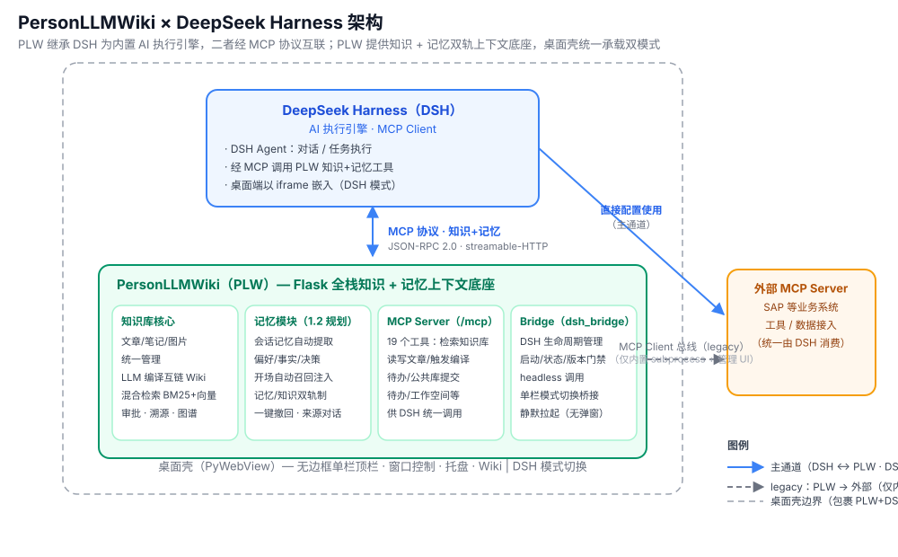

# PersonLLMWiki

**AI-Powered Personal Knowledge Management System**

[](https://www.python.org/)
[](https://flask.palletsprojects.com/)
[](LICENSE)

基于 Flask 的全栈个人知识管理系统，**深度继承 DeepSeek Harness（DSH）作为内置 AI 执行引擎**——桌面端单栏顶栏一键切换「Wiki | DSH」双模式，DSH agent 经 MCP 直接检索知识库、读写文章、触发编译。将散落的笔记、文章、图片统一管理，通过 **LLM 自动编译为互链 Wiki 知识库**；支持 **MCP 双角色**（对外 19 个工具的 Server，接入外部服务的 Client）。支持 **Web 浏览器** 与 **桌面应用**（PyWebView 无边框单栏）两种形态。

---

## 🏗️ 架构



- **DSH（DeepSeek Harness）** — AI 执行引擎，作为 **MCP Client** 经协议调用 PLW 能力（检索知识库 / 读写文章 / 触发编译），桌面端以 iframe 嵌入（DSH 模式）；**亦可直接配置使用外部 MCP Server / Skill（主通道）**
- **PLW（PersonLLMWiki）** — Flask 知识管理系统：知识库核心（文章 → Wiki 编译 → 混合检索）+ **MCP Server**（`/mcp`，19 个工具）+ **Bridge** 桥接层
- **MCP** — 统一协议层（JSON-RPC 2.0 / streamable-HTTP）。**架构方向（三层）**：外部 MCP / Skill 统一由 DSH 消费；DSH ↔ PLW 走 `/mcp`；PLW ↔ 外部 MCP Server（SAP 等）为**过渡态**（MCP Client 总线，规划收敛，见待办）
- **Bridge（dsh_bridge）** — 桌面端管理 DSH 生命周期（启动 / 状态 / 版本门禁）、headless 调用、静默拉起与单栏模式切换
- **桌面壳（PyWebView）** — 无边框单栏自绘标题栏（logo + Wiki|DSH 开关 + 窗口按钮），拖动 / 双击最大化 / 边缘缩放 / 关闭到托盘，统一承载双模式

---

## ✨ 亮点

- **LLM 知识编译** — 文章 → LLM 概念提取 → 概念合并 → 页面生成 → 审批 → 向量索引，增量编译（SHA-256 哈希检测）
- **混合检索** — Embedding API + BM25（jieba）双路召回
- **MCP 双角色** — 既是 MCP Server（对外暴露 19 个工具）供 AI 客户端调用，也是 MCP Client 连接外部服务
- **DSH 集成** — 桌面端顶栏「Wiki \| DSH」模式切换；DSH agent 可直接检索知识库、读写文章、触发编译
- **共享中心** — 技能 / 智能体 / MCP 服务的发布、浏览与一键安装（git 同步）
- **知识星链** — D3.js 力导向图，节点大小反映关联数量
- **Markdown 原生** — 文章以 `.md` 文件存储，零锁定

---

## 📦 功能模块

### 工作台

扁平分区仪表盘，展示收藏文章、天气、数据统计。顶部搜索框输入问题后自动跳转对话页，Agent 模式调用 MCP 工具查询。

### 对话

AI 对话页面，统一走 Agent 模式（LLM + MCP tool-calling）。支持：

- 多模型（OpenAI / Claude / Gemini / Ollama），流式输出
- Wiki 知识库上下文注入
- MCP 工具自动调用
- 对话转存为文章或 Wiki 页面

### 知识库

Swiss-Style Minimalism 卡片网格布局，概念按 kind 分组。标签页：

- **概念** — 已编译的概念卡片，点击查看详情（摘要、正文、来源溯源、相关概念）
- **源文件** — Markdown 源文件列表，标注编译状态，可触发增量/全量编译
- **待审批** — 编译产出的候选页面，逐条审核通过/拒绝

编译管道：`article/*.md → LLM 概念提取 → 概念合并 → 页面生成 → wiki/concepts/*.md → Embedding 向量索引`

### 共享中心

技能（SKILL.md）/ 智能体定义 / MCP 服务定义的**发布、浏览与一键安装**：

- 发布：本地技能/智能体 → 校验（manifest）→ 写入共享仓库 → 更新索引 → git 提交
- 安装：`copy-to`（技能落位本地）/ `mcp-connect`（生成 MCP 客户端配置）
- 共享物标注来源等级：官方库 / 同事 / 外部

### 任务 / 自动化 / 文章 / 图片

- **任务**：五泳道看板（收集箱 / 待办 / 进行中 / 已完成 / 已取消）
- **自动化**：定时 AI Agent 任务（APScheduler），支持周期 / 间隔 / 单次，可经 headless 桥接外部执行引擎
- **文章 / 图片**：Markdown 文件管理、文件夹树、附件上传、图片网格视图

### 设置

LLM 配置、Embedding 配置、用户资料、资源路径、系统更新、外部执行引擎（DSH）关联与升级。

---

## 📌 路线图（待办）

### 架构收敛（1.1：外部 MCP 统一走 DSH 三层架构）

详见 [待办：架构收敛](doc/待办-架构收敛.md)（应用内待办同步记录）。

- [ ] MCP Client 总线（`mcp_client.py` / `/api/mcp/servers`）标记 legacy，1.1 评估移除
- [ ] SAP 定时同步改走 DSH headless（或直连 HTTP/DB），移除 PLW 主动调 SAP MCP 的依赖
- [ ] PLW 内置对话 agent 工具源限缩到自身 19 个 MCP 工具，外部能力一律由 DSH 承接

### 模块完善（1.1：本次发布暂隐藏，完善后重新开放）

- [ ] **共享中心** — 发布 / 安装流程打磨后重新开放菜单
- [ ] **笔记** — 功能完善后重新开放菜单

### 体验迭代

- [ ] 安装版**全自动静默升级**（下载 → 自退出 → 静默安装 → 自动重启）
- [ ] Windows **代码签名**（消除 SmartScreen「未知发布者」提示）

---

## 🏗️ 技术架构

```
src/
├── app.py                              # Flask 应用入口 + SQLite 自动迁移
├── config.py                           # 配置管理
├── desktop.pyw                         # 桌面应用入口（PyWebView）
├── common/                             # 共享层：LLM 适配、Agent 循环、MCP 总线、调度器
├── modules/
│   ├── home/                           # 工作台仪表盘
│   ├── chat/                           # AI 对话
│   ├── wiki/                           # 知识库 + 编译管道 + 混合检索
│   ├── shared/                         # 共享中心（发布/浏览/安装）
│   ├── automation/                     # 定时 AI Agent
│   ├── mcp/                            # MCP Server + Client 双角色
│   ├── todo/                           # 五泳道看板
│   ├── article/  picture/  note/       # 内容管理
│   └── settings/  weather/             # 设置与工具
├── static/                             # CSS / JS / 图标
└── templates/                          # SPA 基础布局
```

**与 DeepSeek Harness（DSH）的分工**：PLW 管「内容与公司能力」（知识编译/检索/审批/工具），DSH 管「执行编排」（goal/workflow/subagent/skills）。二者通过 MCP 标准协议协作，详见 [架构边界与升级指南](doc/README-架构边界与升级指南.md)。

---

## 🚀 快速开始

### 环境要求

| 依赖   | 版本   |
| ------ | ------ |
| Python | >= 3.8 |

### 1. 克隆项目

```bash
git clone https://github.com/zsafly-star/PersonLLMWiki.git
cd PersonLLMWiki
```

### 2. 安装依赖

```bash
pip install -r requirements.txt
```

### 3. 启动

**Web 模式**（浏览器访问 http://localhost:5000）：

```bash
cd src
python app.py
```

**桌面模式**（原生窗口，**无系统标题栏**——单栏自绘标题栏：左侧 logo +「Wiki | DSH」开关 + DSH 状态点，右侧最小化/最大化/关闭按钮；支持顶栏拖动、双击最大化、四边四角边缘缩放、关闭到系统托盘）：

```bash
cd src
python desktop.pyw
```

Windows 开发脚本：`.\dev.ps1 start | stop | restart`（`stop` 按命令行清理整套进程树：应用/MCP/DSH，避免端口残留；`stop -KeepDsh` 保留 DSH）

> 💡 集成 DeepSeek Harness（可选）：在设置页关联已安装的 DSH，即可在桌面端通过「Wiki | DSH」模式切换，让 DSH agent 直接使用知识库。

---

## 📚 文档

- [架构边界与升级指南](doc/README-架构边界与升级指南.md) — 系统总览、PLW 与 DSH 分工、升级方法（**入口文档**）
- [PersonLLMWiki 设计规范](doc/PersonLLMWiki设计规范.md) — 各子系统设计索引
- [DSH 集成架构设计方案](doc/DSH集成架构设计方案.md) — 集成架构、知识供给、共享中心、里程碑
- [打包验证任务书](doc/打包验证任务书.md) — 发版打包验证 SOP（可被任意 AI 工具执行）
- [安装版自动升级设计方案](doc/安装版自动升级设计方案.md) — 安装版 GitHub Releases 检测与升级
- [待办：架构收敛](doc/待办-架构收敛.md) — 外部 MCP 统一走 DSH 的三层架构收敛项（1.1）
- [分发部署方案](doc/分发部署方案.md) — 打包与分发
- [开发者打包发布指南](doc/开发者打包发布指南.md) — 发布流程

---

## 🔌 MCP API 概览

| 接口                      | 方法     | 说明                                                             |
| ------------------------- | -------- | ---------------------------------------------------------------- |
| `/mcp`                  | POST     | JSON-RPC 2.0（streamable-HTTP），`tools/list` / `tools/call` |
| `/api/wiki/compile`     | POST     | 触发知识编译（增量/全量）                                        |
| `/api/wiki/pages`       | GET      | 概念页面列表                                                     |
| `/api/wiki/candidates`  | GET      | 待审批页面                                                       |
| `/api/chat/sessions`    | GET/POST | 对话会话                                                         |
| `/api/automation/tasks` | GET/POST | 定时任务                                                         |
| `/api/shared/items`     | GET      | 共享中心条目                                                     |
| `/api/shared/publish`   | POST     | 发布共享物                                                       |

---

## 💾 数据存储

所有用户数据以文件系统为主，SQLite 为辅，**零云依赖**：

| 数据              | 存储方式                    | 位置                                           |
| ----------------- | --------------------------- | ---------------------------------------------- |
| 知识库文章        | Markdown 文件               | `{RESOURCE_BASE_PATH}/article/`              |
| Wiki 概念页面     | Markdown + JSON Frontmatter | `{RESOURCE_BASE_PATH}/wiki/concepts/`        |
| 向量索引          | JSON                        | `{RESOURCE_BASE_PATH}/wiki/embeddings.json`  |
| 图片 / 附件       | 文件系统                    | `{RESOURCE_BASE_PATH}/img/` `attachments/` |
| 聊天记录 / 元数据 | SQLite                      | `{RESOURCE_BASE_PATH}/instance/sseditor.db`  |

---

## 🧰 技术栈

| 类别             | 技术                                                                           |
| ---------------- | ------------------------------------------------------------------------------ |
| **后端**   | Flask, SQLAlchemy, APScheduler, SQLite                                         |
| **桌面**   | PyWebView (WebView2), pystray, PyInstaller, Inno Setup（无边框单栏自绘标题栏）  |
| **前端**   | 原生 JavaScript, Jinja2 模板, D3.js v7                                         |
| **AI**     | OpenAI API, Anthropic API, Gemini API, Ollama                                  |
| **检索**   | Embedding API + fastembed（本地 ONNX）+ BM25（jieba）                          |
| **文档解析** | PyMuPDF（PDF MCP）                                                             |
| **MCP**    | JSON-RPC 2.0 over HTTP（streamable-HTTP）                                      |
| **智能体** | [DeepSeek Harness](https://github.com/deepseek-ai/deepseek-harness)（**深度集成，内置 AI 执行引擎**） |

---

## 🙏 感谢

- [DeepSeek Harness](https://github.com/deepseek-ai/deepseek-harness)（深度集成，内置 AI 执行引擎）
- [Flask](https://github.com/pallets/flask)
- [PyWebView](https://pywebview.flowrl.com/)、[PyInstaller](https://pyinstaller.org/)、[Inno Setup](https://jrsoftware.org/isinfo.php)、[pystray](https://github.com/moses-palmer/pystray)（桌面壳与打包分发）
- [jieba](https://github.com/fxsjy/jieba)、[fastembed](https://github.com/qdrant/fastembed)（ONNX）、[PyMuPDF](https://pymupdf.readthedocs.io/)（中文分词检索、本地向量化、PDF 解析）
- [D3.js](https://d3js.org/)（知识星链可视化）
- llm-wiki-compiler（LLM Wiki 模式启发）
- [Trae](https://www.trae.ai/)（AI 编码助手，主要代码实现伙伴）

---

## 📄 许可证

[MIT License](LICENSE)
