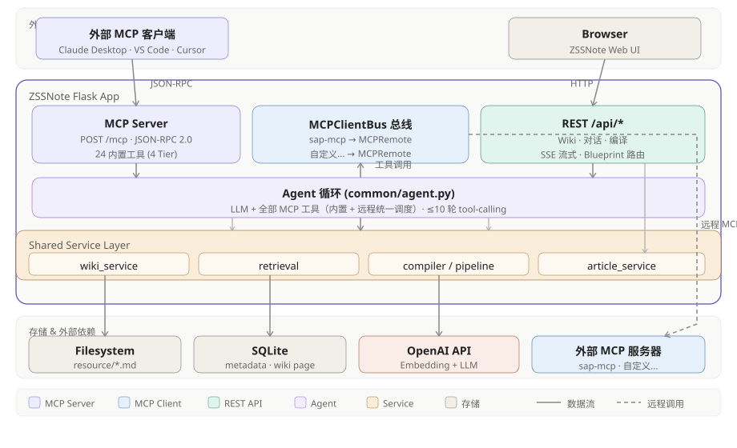
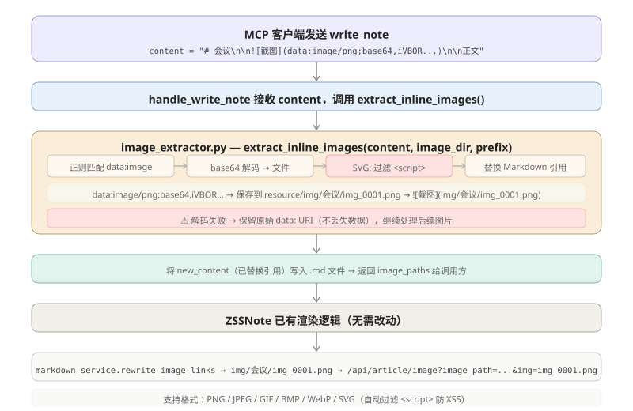
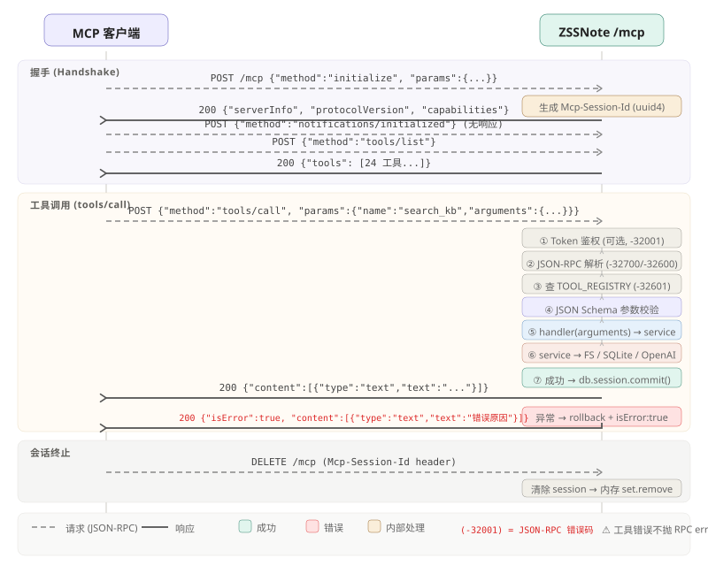

# ZSSNote MCP 设计文档（v3.0）

> 目标：让 MCP 客户端通过 MCP 协议用自然语言读写 ZSSNote 知识库、操作 Office 文档、联网搜索。
> 架构：Flask 内手写 `/mcp` 端点（零新增依赖）+ Agent 自动调用全部工具 + 声明式内置服务管理。
> 当前状态：25 个 embedded 工具 + 3 个内置服务（officecli 9 / pdf-mcp 13 / websearch 1）+ 远程自定义服务接入。



---

## 1. 为什么手写 Handler

| 维度 | 手写 | 官方 mcp SDK |
|------|------|-------------|
| 新依赖 | 零 | `pip install mcp`（含 pydantic、anyio 等） |
| Flask 集成 | 天然 Blueprint | SDK 偏向 ASGI，要包一层 |
| 控制力 | 完全 | 受 SDK 抽象约束 |
| 协议合规 | 自己保证 | SDK 保证 |
| 代码量 | ~250 行 handler | ~150 行 + SDK 黑盒 |

**结论**：ZSSNote 已有干净的 service 层（`wiki_service`、`retrieval`、`pipeline`、`article`），MCP handler 本质只是 JSON-RPC → service 函数的薄薄一层胶水。手写既能保持"零云依赖"哲学，又避免 SDK 的 ASGI/同步 Flask 适配坑。

**手写可行的关键前提**：ZSSNote 的 MCP **不需要服务端推送（SSE）**。编译是异步触发 + 客户端轮询 `get_compile_status`，所有工具都是请求→响应。这让 streamable-HTTP 退化成"纯 JSON POST"，复杂度骤降。

---

## 2. 架构总览

### 2.1 双角色 + 内置服务架构

ZSSNote 在 MCP 生态中扮演双重角色，同时管理本地内置 MCP 服务：

```
┌──────────────────────────────────────────────────────────┐
│                       ZSSNote                            │
│                                                          │
│  ┌──────────────┐  ┌──────────────┐  ┌──────────────┐   │
│  │ MCP Server   │  │ 内置服务管理 │  │ MCP Client   │   │
│  │ (POST /mcp)  │  │ (builtin_mgr)│  │ (MCPClientBus)│   │
│  │              │  │              │  │              │   │
│  │ 25 内置工具  │  │ officecli    │  │ sap-mcp → .. │   │
│  │ • 知识库读写 │  │ pdf-mcp      │  │ 自定义 → ...  │   │
│  │ • Office 文档│  │ websearch    │  │              │   │
│  │ • 任务管理   │  │ zssnote      │  │ 工具 → Agent │   │
│  └──────┬───────┘  └──────┬───────┘  └──────┬───────┘   │
│         │                 │                 │            │
│         └─────────┬───────┴─────────┬───────┘            │
│                   ▼                 ▼                    │
│         ┌──────────────┐  ┌──────────────────────┐      │
│         │ Agent 循环    │  │ 统一 API /mcp/services│     │
│         │ (agent.py)    │  │ 前端 MCP 管理页面     │      │
│         │ LLM + 全部工具│  │ 合并展示内置+自定义   │      │
│         │ ≤10 轮调用    │  └──────────────────────┘      │
│         └──────────────┘                                 │
└──────────────────────────────────────────────────────────┘
```

| 角色 | 模块 | 说明 |
|------|------|------|
| **MCP Server** | `modules/mcp/routes.py` | 对外暴露 `/mcp` 端点，供外部 MCP 客户端连接 |
| **内置服务管理** | `common/builtin_mcp_manager.py` | 管理 `bin/mcp/*/service.json`，三种类型：binary/subprocess/embedded |
| **MCP Client** | `common/mcp_client.py` | MCPClientBus 总线，连接远程服务器 + 内置服务注册 |
| **Agent 循环** | `common/agent.py` | 统一使用本地 + 内置 + 远程工具，自动调用 |

### 2.2 Agent 自动调用

对话页**始终启用 Agent 模式**，不再需要手动开关：

```
用户在对话页输入
  → Agent 循环（≤10 轮）
    → 第 1 轮：LLM 决定调用哪些 MCP 工具
    → 工具返回结果，注入上下文
    → 第 2 轮：LLM 基于工具结果继续推理
    → ...直到 LLM 给出最终回复
  → SSE 流式返回给前端
```

Wiki 知识库上下文自动注入到用户消息末尾（`---` 分隔符），Agent 无需额外检索即可感知已有知识。

---

## 3. 传输与协议

### 3.1 传输选择：streamable-HTTP（非 SSE）

```
MCP 客户端 --POST /mcp (JSON-RPC 2.0)--> ZSSNote Flask
ZSSNote  --200 OK (application/json)--> MCP 客户端
```

- 单一端点：`POST /mcp`
- 请求/响应都是单个 JSON-RPC 2.0 对象
- `Content-Type: application/json`
- **不实现 SSE 流**——所有工具同步返回。编译进度由 `get_compile_status` 工具轮询
- 这是合法的 streamable-HTTP：规范允许服务端始终用纯 JSON 响应，streaming 是可选能力

### 3.2 JSON-RPC 方法

| 方法 | 说明 |
|------|------|
| `initialize` | 协议握手，返回 protocolVersion / capabilities / serverInfo |
| `notifications/initialized` | 客户端通知初始化完成（notification，无响应） |
| `ping` | 心跳 |
| `tools/list` | 返回工具清单 |
| `tools/call` | 调用工具，name + arguments |

### 3.3 协议版本

`2025-06-18`（MCP 最新稳定版）。

---

## 4. 端点与 Flask 集成

### 4.1 文件结构

```
src/modules/mcp/
├── __init__.py            # 导出 mcp_bp，触发工具注册
├── routes.py              # Blueprint + POST /mcp 端点 + JSON-RPC 分发（Server 角色）
├── client_routes.py       # MCP Client 路由：内置+自定义服务管理 + 统一 API
├── registry.py            # Tool dataclass + TOOL_REGISTRY（全局注册表）
├── tools_registration.py  # 集中导入所有 handler，触发注册（当前 25 工具）
├── security.py            # 路径安全（commonpath 越界检测 + .md 扩展名白名单）
├── image_extractor.py     # 内联 data URI 图片提取（base64 → 文件 + SVG 过滤）
├── errors.py              # JSON-RPC 错误码常量 + MCPError 异常
├── tools_read.py          # Tier 1 只读工具 handlers（7 个）
├── tools_search.py        # Tier 2 检索工具 handlers（1 个）
├── tools_write.py         # Tier 3 写入工具 handlers（7 个，含 submit_to_public / create_todo）
└── tools_office.py        # Tier 4 OfficeCLI 工具 handlers（9 个）

src/common/
├── mcp_client.py          # MCPClientBus 总线（远程服务器连接 + 统一工具调度）
├── builtin_mcp_manager.py # 内置服务管理器（bin/mcp/*/service.json 自发现 + 生命周期）
└── agent.py               # Agent 循环（LLM + 全部 MCP 工具）

src/bin/mcp/               # 内置 MCP 服务目录（每个文件夹自包含 service.json）
├── officecli/service.json # binary 类型（9 tools）
├── pdf-mcp/               # subprocess 类型（13 PDF tools）
│   ├── service.json
│   ├── launcher.py
│   └── pdf_mcp/           # 自包含源码
├── websearch/             # subprocess 类型（1 web search tool）
│   ├── service.json
│   ├── launcher.py
│   └── websearch_mcp/     # 自包含源码（DuckDuckGo Lite，零第三方依赖）
└── zssnote/service.json   # embedded 类型（25 tools, ZSSNote 自身对外 MCP Server）
```

在 `app.py` 注册：`from modules.mcp import mcp_bp` + `app.register_blueprint(mcp_bp)`。
Flask 启动需 `app.run(threaded=True)` 以支持并发工具调用。

### 4.2 MCPClientBus — 客户端总线

`common/mcp_client.py` 中的 `MCPClientBus` 是 MCP Client 角色的核心调度器：

```
                    ┌─────────────────────────────┐
                    │       MCPClientBus           │
                    │  (全局单例, get_bus())       │
                    │                              │
                    │  ┌──────────────────────┐    │
                    │  │ 远程 MCP 服务器池     │    │
                    │  │ sap-mcp → MCPRemote  │    │
                    │  │ pdf-mcp → MCPRemote  │    │
                    │  │ 自定义... → MCPRemote│    │
                    │  └──────────┬───────────┘    │
                    │             │                 │
                    │  ┌──────────▼───────────┐    │
                    │  │ 统一工具发现           │    │
                    │  │ get_all_tools()       │    │
                    │  │ 本地 + 远程合并        │    │
                    │  └──────────┬───────────┘    │
                    │             │                 │
                    │  ┌──────────▼───────────┐    │
                    │  │ 统一工具调用           │    │
                    │  │ call_tool(name, args) │    │
                    │  │ 本地直接调 handler     │    │
                    │  │ 远程路由到 MCPRemote   │    │
                    │  └──────────────────────┘    │
                    └─────────────────────────────┘
```

**职责**：

| 方法 | 说明 |
|------|------|
| `add_server(name, url, token?, persist=True)` | 添加并连接 MCP 服务器。`persist=False` 用于内置服务（不写入 mcp_servers.json） |
| `remove_server(name)` | 移除服务器并清理持久化文件 |
| `reconnect(name)` | 重连远程服务器（检测工具列表变化） |
| `get_all_tools()` | 合并本地 + 所有远程工具，统一格式 |
| `get_tools_for_llm()` | 转为 OpenAI function calling 格式，供 Agent 使用 |
| `call_tool(full_name, args)` | 统一调用入口：`server__tool` → 远程；`tool` → 本地 |
| `list_servers()` | 所有远程服务器连接状态（不含内置，内置由 builtin_mcp_manager 管理） |

**内置服务注册**：`builtin_mcp_manager` 在子进程启动成功后调用 `bus.add_server(name, url, token, persist=False)`。token 每次随机生成不落盘，`persist=False` 确保不污染 `mcp_servers.json`。

**工具名路由规则**：
- 本地工具：直接名称（如 `read_note`、`search_kb`）
- 远程/内置 subprocess 工具：`{server_name}__{tool_name}`（如 `sap-mcp__search_materials`、`pdf-mcp__read_pdf`）
- Agent 通过 `__` 分隔符自动路由到正确的服务器

**线程安全**：`_bus_lock` (RLock) 保护共享状态，网络 I/O 在锁外执行避免阻塞。

**配置文件**：`resource/instance/mcp_servers.json`
```json
{
  "servers": [
    {"name": "sap-mcp", "url": "http://192.168.195.191:8001/mcp", "token": "", "description": "SAP 物料查询"}
  ]
}
```

### 4.3 Client Routes — REST API

| 端点 | 方法 | 说明 |
|------|------|------|
| `/api/mcp/services` | GET | **统一端点**：合并内置（bin/mcp/*/service.json）+ 自定义（mcp_servers.json），每个服务带 source/location/type 标签 |
| `/api/mcp/servers` | POST/DELETE | 自定义 MCP 服务器 CRUD（JSON 格式批量添加） |
| `/api/mcp/servers/<name>/tools` | GET | 获取指定服务工具列表（subprocess→MCPClientBus / binary→本地 registry / embedded→全部本地工具） |
| `/api/mcp/servers/<name>/reconnect` | POST | 重连服务（subprocess→停止+重启子进程 / 自定义→bus.reconnect） |
| `/api/mcp/stats` | GET | MCP 统计信息 |

**统一 API 数据源合并逻辑** (`GET /api/mcp/services`)：

| 数据源 | source | location | 获取方式 |
|--------|--------|----------|----------|
| `builtin_mcp_manager._statuses` | builtin | 从 service.json | 后台线程扫描 `bin/mcp/*/service.json` |
| `MCPClientBus._remote_clients` | custom | remote | 从 `mcp_servers.json` 加载 |
| zssnote 保底注入 | builtin | local | 若后台线程未及注册，直接注入 |

**返回字段**：`name`, `description`, `source` (builtin/custom), `location` (local/remote), `type` (binary/subprocess/embedded), `connected`, `tool_count`, `url`, `error`, `can_delete`, `can_reconnect`。

> **注意**：`connected` 为**布尔值**（`true`/`false`），前端过滤时应直接判断 `s.connected`，不要按字符串 `s.status === 'connected'` 匹配。

**重连 API 行为** (`POST /api/mcp/servers/<name>/reconnect`)：

| 服务类型 | 行为 |
|----------|------|
| subprocess | `_stop_service()` → `start_service()` 停止旧子进程，重新拉起并注册 |
| custom/remote | `bus.reconnect()` 重做 MCP 握手 |
| embedded/binary | 返回 400（不支持重连） |

### 4.4 路由骨架

```python
@mcp_bp.route('/mcp', methods=['POST'])
def mcp_endpoint():
    # 1. 鉴权（可选）
    # 2. 解析 JSON-RPC
    # 3. 分发到 method handler
    # 4. tools/call → 查 registry → 调 service → 包 JSON-RPC 响应
    # 5. DB session: handler 内部 commit/rollback，teardown 自动 remove
```

### 4.5 DB Session 管理

handler 直接复用现有 service 函数，service 函数内部已用 `db.session`。MCP 层只负责：
- handler 抛异常 → `db.session.rollback()`
- 正常返回 → 依赖 Flask-SQLAlchemy teardown 自动 `db.session.remove()`

**不**在 MCP 层做 `with app.app_context()`——路由本身已在 app context 内。

### 4.6 并发

Flask 开发服务器需 `app.run(threaded=True)`；生产用 gunicorn `--workers 1 --threads 4`（ZSSNote 是单用户本地应用，无需多 worker）。

---

## 5. 会话与鉴权

### 5.1 会话：准无状态

- `initialize` 生成 `Mcp-Session-Id`（uuid4），存入内存 `set`
- 后续请求带该 header，校验存在即可
- 不在 session 里存任何业务状态——每个工具调用独立
- `DELETE /mcp` 清除 session ID（规范要求的会话终止）

### 5.2 鉴权：可选 token

```python
token = os.environ.get('ZSSNOTE_MCP_TOKEN')
if token:
    if request.headers.get('Authorization') != f'Bearer {token}':
        return error(-32001, "Unauthorized", http=401)
```

- 本地单用户场景默认不设 token
- 若 ZSSNote 绑定到 0.0.0.0 或暴露到内网，强烈建议设 token
- ZSSNote 默认绑定 127.0.0.1，localhost 信任即可

---

## 6. 工具注册表设计

```python
@dataclass
class Tool:
    name: str
    description: str           # 给 LLM 看的，< 100 字，说明意图/成本/安全
    input_schema: dict         # JSON Schema
    handler: Callable[[dict], dict]   # params → {content: [...]} 或 {isError: True}
    cost: str                  # "none" | "openai-embedding" | "openai-llm"

TOOL_REGISTRY: list[Tool] = [...]
```

`tools/list` 响应直接序列化 `TOOL_REGISTRY`（去掉 handler 字段）。

`tools/call` 流程：
```
1. name → 查 registry 找 Tool
2. arguments → JSON Schema 校验（手写校验）
3. 调 handler(arguments)
4. handler 返回 {"content": [{"type":"text","text": json.dumps(...)}]}
5. 异常 → {"isError": True, "content": [...]}
```

---

## 7. 工具清单（完整，25 工具）

### Tier 1 — 只读（知识库，无成本，7 个）

| 工具 | 入参 | 说明 |
|------|------|------|
| `list_folders` | `{}` | 列出文章知识库目录结构 |
| `read_note` | `{path, full?}` | 读取文章，默认摘要，full=true 返回全文 |
| `list_wiki_pages` | `{limit?, offset?}` | 列出已审批 Wiki 概念页 |
| `read_wiki_page` | `{slug}` | 读取概念页正文（含来源溯源） |
| `get_compile_status` | `{}` | 查询 Wiki 编译进度（轮询用） |
| `list_candidates` | `{limit?}` | 列出待审批候选页面 |
| `get_graph` | `{seed?, depth?}` | 知识星链图谱（全图上限 80 节点） |

### Tier 2 — 检索（消耗 OpenAI Embedding，1 个）

| 工具 | 入参 | 说明 |
|------|------|------|
| `search_kb` | `{query, top_k?}` | 语义检索（向量 0.7 + BM25 0.3 混合排序） |

### Tier 3 — 写入（变更数据，需谨慎，7 个）

| 工具 | 入参 | 说明 |
|------|------|------|
| `write_note` | `{path, content, create_folders?}` | 创建/覆盖文章（含内联图片提取） |
| `create_folder` | `{path, icon?}` | 创建文件夹 |
| `compile_wiki` | `{incremental?, init?}` | 触发 Wiki 编译（消耗 LLM 配额） |
| `approve_candidate` | `{id}` | 通过候选页，正式入库 |
| `reject_candidate` | `{id}` | 拒绝并删除候选页 |
| `submit_to_public` | `{title, body, summary?, sources?, kind?, author?}` | 提交知识到公共库 |
| `create_todo` | `{title, description?, priority?}` | 创建待办任务 |

### Tier 4 — OfficeCLI 文档办公（内嵌二进制，9 个）

OfficeCLI 是 `.NET` 独立可执行文件，通过 `subprocess` 调用实现 Word/Excel/PPT 操作。二进制已预打包到 `src/bin/officecli/` 目录（6 平台），首次服务启动即可用，无需外部安装。

| 工具 | 入参 | 说明 |
|------|------|------|
| `read_document` | `{path}` | 读取文档 → HTML 渲染内容 |
| `get_document_structure` | `{path, selector?}` | 获取 JSON 结构化数据 |
| `get_document_outline` | `{path}` | 获取文档大纲（PPT 标题/Word 段落） |
| `create_document` | `{path}` | 创建空白 Office 文档 |
| `add_element` | `{path, target?, type, props?}` | 添加元素（文本/表格/图片等） |
| `set_element` | `{path, selector, props}` | 修改元素属性 |
| `list_sheets` | `{path}` | 列出 Excel 工作表 |
| `read_sheet` | `{path, sheet?, range?}` | 读取 Excel 数据 |
| `write_cells` | `{path, sheet?, cells}` | 批量写入 Excel 单元格 |

**设计要点**：
- `_get_platform_id()` 自动检测平台（windows→win, darwin→mac, x86_64→x64, arm64→arm64）
- 优先级：环境变量 `OFFICECLI_PATH` > `bin/officecli/` > 系统 PATH
- `_run_officecli(args, timeout=120)` 统一调用封装，返回 `(returncode, stdout, stderr)`
- 9 个 handler 均为薄胶水层，将 JSON Schema 参数映射为 OfficeCLI CLI 参数

---

## 8. 内联图片提取（write_note 集成）



### 8.1 动机
MCP 客户端等发送的 Markdown 常包含内联 `data:image/...;base64,...` 图片（截图、示意图）。若直接写入 `.md`，会导致：
- 文件体积膨胀（base64 比二进制大 33%）
- ZSSNote 图片管理器看不到这些图片
- 无法被 ZSSNote 的图片预览/搜索索引识别

### 8.2 实现位置
独立模块 [image_extractor.py](../modules/mcp/image_extractor.py)，由 `handle_write_note` 在写入文件前调用。

### 8.3 数据流
```
MCP 客户端发送:
  content = "# 会议\n\n\n\n正文"

write_note 处理:
  1. 解析 path → 取 md_stem（不含路径、不含扩展名）
  2. image_dir = resource/img/<md_stem>/
  3. markdown_prefix = "img/<md_stem>/"
  4. extract_inline_images(content, image_dir, markdown_prefix):
     ├── 正则匹配 
     ├── base64 解码 → 保存到 image_dir
     ├── SVG 过滤 <script>...</script>
     ├── 替换 Markdown 为 
     └── 返回 (new_content, saved_abs_paths)
  5. 写 new_content 到 .md 文件
  6. 返回 image_paths

ZSSNote 渲染（已有逻辑，无需改动）:
  markdown_service.rewrite_image_links 把 img/xxx 自动改写为
  /api/article/image?image_path=...&img=xxx
```

### 8.4 支持的格式

| MIME | 扩展名 | 备注 |
|------|--------|------|
| `image/png` | `.png` | |
| `image/jpeg` | `.jpg` | MIME 为 jpeg，扩展名为 jpg |
| `image/gif` | `.gif` | |
| `image/bmp` | `.bmp` | |
| `image/webp` | `.webp` | |
| `image/svg+xml` | `.svg` | 自动过滤 `<script>` 防 XSS |

### 8.5 安全
1. **SVG XSS 防护**：`_sanitize_svg()` 用正则移除所有 `<script>` 标签
2. **无路径注入风险**：图片目录由服务端从 `md_stem` 派生
3. **兼容现有安全边界**：图片写入 `resource/img/`，与 `resource/article/` 正交

---

## 9. 安全规则（强制）

### 9.1 路径安全
所有 `path` 入参必须：
```python
article_root = os.path.abspath(Config.ARTICLE_PATH)
real_path = os.path.abspath(os.path.join(article_root, path))
if os.path.commonpath([article_root, real_path]) != article_root:
    raise MCPError(-32602, "路径越界")
```

### 9.2 写入边界
- `write_note` 只能写 `resource/article/` 下
- 禁止写 `resource/wiki/`（Wiki 页面是编译产物，不可手改）
- 扩展名白名单：`.md`（其他一律拒绝）

### 9.3 LLM 不可自审批
- **不提供** `auto_approve` / `approve_all` 工具
- `approve_candidate` 工具描述里写明"应仅在用户明确要求时调用"
- 这是防止知识库被 LLM 生成内容污染的核心防线

### 9.4 删除保护
- **不提供** `delete_note` 工具（删除走 ZSSNote UI，避免 AI 误删）
- 候选页 `reject` 是唯一删除路径，且只删未入库的候选

---

## 10. 错误处理



### 10.1 JSON-RPC 错误码

| code | 含义 | 场景 |
|------|------|------|
| -32700 | Parse error | JSON 解析失败 |
| -32600 | Invalid request | 不是合法 JSON-RPC |
| -32601 | Method not found | 未知 method |
| -32602 | Invalid params | 参数校验失败 / 路径越界 |
| -32603 | Internal error | service 层异常 |
| -32001 | Unauthorized | token 校验失败 |

### 10.2 工具错误
工具内部异常不抛 JSON-RPC error，而是返回 `{"isError": true, "content": [{"type":"text","text": error_msg}]}`，让 LLM 能读到错误原因并自行修正。

### 10.3 成本敏感工具的失败
`search_kb` / `compile_wiki` 失败时，错误信息里附带"本次可能已消耗部分 OpenAI 配额"提示。

---

## 11. MCP 客户端配置

### 11.1 mcp.json

标准 MCP 客户端（支持 `streamable-http` 传输）可通过 `mcp.json` 连接 ZSSNote。

最小配置（本地信任模式）：
```json
{
  "mcpServers": {
    "zssnote": {
      "url": "http://localhost:5000/mcp",
      "transport": "streamable-http"
    }
  }
}
```

启用 token 鉴权（ZSSNote 绑定 0.0.0.0 或暴露内网时）：
```json
{
  "mcpServers": {
    "zssnote": {
      "url": "http://localhost:5000/mcp",
      "transport": "streamable-http",
      "headers": {
        "Authorization": "Bearer <ZSSNOTE_MCP_TOKEN>"
      }
    }
  }
}
```

### 11.2 连接流程
1. 客户端启动时 POST `initialize`
2. 收到 protocolVersion + tools 清单
3. 连接器状态显示"已连接"
4. 用户自然语言 → 客户端选工具 → `tools/call`

---

## 12. 内置 MCP 服务管理

### 12.1 设计理念：自包含 + 声明式发现

每个内置 MCP 服务在 `bin/mcp/<name>/` 下自包含，由 `service.json` 声明。`builtin_mcp_manager.py` 扫描 `bin/mcp/*/service.json` 自动发现，与 Skills 的 `SKILL.md` 模式一致：删除文件夹 = 移除服务，添加文件夹 = 新增服务。

### 12.2 工具的四种存在形式与统一管理

ZSSNote 中所有 MCP 工具按代码位置和通信方式分为四种存在形式，最终由 `MCPClientBus` 统一调度：

| 形式 | service.json type | 代码位置 | 通信方式 | 工具命名 | Agent 调用 | 升级方式 |
|------|-------------------|----------|----------|----------|------------|----------|
| **嵌入式** | `embedded` | `modules/mcp/tools_*.py` | 进程内直调 handler | `read_note` | 直接名称 | 改 modules/ 代码 |
| **二进制** | `binary` | `bin/mcp/officecli/` | subprocess 调用二进制 | `create_document` | 直接名称 | 替换 bin/mcp/ 文件夹 |
| **子进程** | `subprocess` | `bin/mcp/*/` 自包含源码 | HTTP JSON-RPC 独立进程 | `pdf-mcp__pdf_search` | `server__tool` | 替换 bin/mcp/ 文件夹 |
| **远程自定义** | —（用户配置） | 用户 `mcp_servers.json` | HTTP JSON-RPC 远程服务器 | `sap-mcp__get_material` | `server__tool` | 用户自行管理 |

**统一管理链路**：

```
                    ┌─────────────────────────────────────────────┐
                    │              MCPClientBus (get_bus)          │
                    │              全局单例 + 线程安全              │
                    │                                              │
                    │  get_all_tools()  ← 统一工具发现              │
                    │  call_tool(name)  ← 统一工具调用              │
                    │    ├─ 无 __ 分隔 → 本地 registry handler      │
                    │    └─ 含 __ 分隔 → MCPRemoteClient HTTP 转发  │
                    └──────────────┬───────────────────────────────┘
                                   │
            ┌──────────────────────┼──────────────────────┐
            ▼                      ▼                      ▼
   ┌─────────────────┐   ┌─────────────────┐   ┌─────────────────┐
   │   本地工具池      │   │  内置 subprocess │   │  远程自定义服务   │
   │                  │   │                  │   │                  │
   │ embedded(25)     │   │ pdf-mcp(13)      │   │ sap-mcp(16)      │
   │ binary(9)        │   │ websearch(1)     │   │ 用户添加...       │
   │                  │   │                  │   │                  │
   │ builtin_mgr 发现  │   │ builtin_mgr 拉起  │   │ mcp_servers.json │
   │ 进程内直调        │   │ HTTP JSON-RPC    │   │ HTTP JSON-RPC    │
   └─────────────────┘   └─────────────────┘   └─────────────────┘
            │                      │                      │
            └──────────────────────┼──────────────────────┘
                                   ▼
                    ┌──────────────────────────────┐
                    │   前端控制台 /automation       │
                    │   MCP Tab 统一展示             │
                    │   [内置/自定义] [本地/远程]    │
                    └──────────────────────────────┘
```

**关键设计**：无论哪种形式，Agent 都通过 `MCPClientBus.get_all_tools()` 获取统一的工具列表，通过 `call_tool(name, args)` 统一调用。`__` 命名空间前缀是唯一的路由依据——Agent 不需要知道工具是本地还是远程。

### 12.3 bin/mcp 目录结构

```
bin/mcp/
├── officecli/                 ← binary 类型
│   ├── service.json
│   └── officecli-*.exe
├── pdf-mcp/                   ← subprocess 类型
│   ├── service.json
│   ├── pdf_mcp/               ← 自包含源码（替代 pip install pdf-mcp）
│   ├── launcher.py            ← streamable-http 启动脚本
│   ├── models/                ← 嵌入模型 (HF 镜像下载)
│   └── cache/                 ← SQLite 缓存
├── websearch/                 ← subprocess 类型
│   ├── service.json
│   ├── launcher.py            ← streamable-http 启动脚本
│   └── websearch_mcp/         ← 自包含源码（DuckDuckGo Lite）
└── zssnote/                   ← embedded 类型
    └── service.json
```

### 12.4 三种服务类型

| 类型 | 说明 | 启动方式 | 可重连 | 工具查询 |
|------|------|----------|--------|----------|
| `binary` | 预编译二进制，本地 handler 直接调用 | 文件存在性检查 | 否 | 本地 registry `_BUILTIN_GROUPS` |
| `subprocess` | Pip 包 MCP 服务器，子进程拉起 | Popen → TCP 健康检查 → bus.add_server(persist=False) | 是 | MCPClientBus |
| `embedded` | 嵌入当前进程，始终可用 | 无需启动 | 否 | 全部本地 registry 工具 |

### 12.5 service.json 字段规范

```json
{
  "name": "pdf-mcp",
  "source": "builtin",
  "location": "local",
  "type": "subprocess",
  "description": "PDF 文档读取、搜索、分页、大纲等",
  "command": "python",
  "args": ["{bin_dir}/launcher.py"],
  "host": "127.0.0.1",
  "port": 17654,
  "path": "/mcp",
  "health_path": "/health",
  "auth_token_env": "PDF_MCP_AUTH_TOKEN",
  "startup_timeout": 30,
  "env": {
    "FASTEMBED_CACHE_PATH": "{bin_dir}/models",
    "FASTEMBED_HOME": "{bin_dir}/models",
    "HF_ENDPOINT": "https://hf-mirror.com"
  },
  "ensure_dirs": ["models", "cache"]
}
```

**模板变量**：`{bin_dir}` → `bin/mcp/<name>/` 绝对路径，`{name}` → 服务名。

**错误处理**：subprocess 启动失败 → `stderr.log` 写入服务目录；竞态条件 → `_worker` 循环内 try/except，单服务失败不阻塞其他；统一 API 在 `connected=true 且 tool_count>0` 时自动清除 `error`。

### 12.6 管理器生命周期

```
app.py 启动
  → init_all_async() 守护线程（不阻塞 Flask）
    → _discover_services() 扫描 bin/mcp/*/service.json
    → 逐个 start_service()
      ├─ binary   → _check_binary_service() 文件存在性 → 设置 status
      ├─ subprocess → _start_subprocess_service()
      │               ├─ Popen 拉起子进程
      │               ├─ 健康检查（HTTP GET → TCP socket 回退）
      │               └─ bus.add_server(persist=False)
      └─ embedded → _check_embedded_service() 直接返回可用
```

## 13. OfficeCLI 集成

### 13.1 设计决策：内嵌而非外部部署

| 方案 | 优点 | 缺点 |
|------|------|------|
| 外部部署（用户手动安装） | 解耦 | 用户需额外操作、版本不一致、多平台麻烦 |
| 内嵌二进制（本项目采用） | 开箱即用、版本统一 | 增大仓库体积（~200MB / 6 平台） |

选择内嵌：OfficeCLI 是独立 `.NET` 二进制，无运行时依赖，直接 `subprocess` 调用即可。由 `bin/mcp/officecli/service.json` 声明为 `binary` 类型，`builtin_mcp_manager` 自动发现。

### 13.2 二进制管理

```
src/bin/officecli/
├── officecli-linux-x64       (33.66 MB)
├── officecli-linux-arm64     (33.10 MB)
├── officecli-mac-arm64       (32.18 MB)
├── officecli-mac-x64         (33.76 MB)
├── officecli-win-x64.exe     (33.76 MB)
└── officecli-win-arm64.exe   (32.23 MB)
```

- 来源：GitHub Releases `v1.0.143`
- `.gitignore` 不忽略 `bin/officecli/`（已提交仓库）
- 启动时自动匹配平台，无需配置

### 13.3 调用封装

```python
def _get_platform_id():
    """darwin→mac, windows→win, x86_64→x64, arm64→arm64"""

def _run_officecli(args, timeout=120):
    """统一 subprocess 调用，返回 (returncode, stdout, stderr)"""
    cli_path = _get_officecli_path()  # 环境变量 > bin/ > PATH
    return subprocess.run([cli_path] + args, capture_output=True, ...)
```

### 13.4 工具 → CLI 映射

| MCP 工具 | OfficeCLI 命令 |
|----------|----------------|
| `read_document` | `view <path> html` |
| `get_document_structure` | `get <path> <selector> --json` |
| `get_document_outline` | `view <path> outline` |
| `create_document` | `create <path>` |
| `add_element` | `add <path> <target> --type <t> --prop k=v ...` |
| `set_element` | `set <path> <selector> --prop k=v ...` |
| `list_sheets` | `get <path> / --json` → 解析 sheets |
| `read_sheet` | `get <path> $<sheet>:<range> --json` |
| `write_cells` | `set <path> $<sheet>:<cell> --prop value=v` （逐单元格） |

---

## 14. pdf-mcp 集成

### 14.1 设计决策：自包含源码

pdf-mcp 是开源 PDF MCP 服务器（GitHub: jztan/pdf-mcp），提供 13 个 PDF 工具，引擎为 PyMuPDF (fitz)。原方案通过 `pip install pdf-mcp` 安装，现改为自包含方案：

| 方案 | 优点 | 缺点 |
|------|------|------|
| pip install | 简单 | 依赖 npm registry、版本锁定困难、不易迁移 |
| 自包含源码（本项目采用） | 换电脑即用、不受 PyPI 影响、统一管理 | 需复制源码、手动声明依赖 |

`bin/mcp/pdf-mcp/pdf_mcp/` 包含 pdf-mcp 全部源码，`launcher.py` 以 streamable-http 模式启动服务。Runtime 依赖（pymupdf、fastembed、fastmcp）在 `requirements.txt` 中声明。

### 14.2 嵌入模型管理

pdf-mcp 依赖 fastembed 嵌入模型（BAAI/bge-small-en-v1.5），下载位置通过环境变量重定向：

```
FASTEMBED_CACHE_PATH = bin/mcp/pdf-mcp/models/
FASTEMBED_HOME = bin/mcp/pdf-mcp/models/
HF_ENDPOINT = https://hf-mirror.com  （国内镜像加速）
```

模型文件不进入 Git（约 67MB），通过 `dev.ps1 init` 或首次启动时自动下载。

### 14.3 13 个 PDF 工具

| 工具 | 说明 |
|------|------|
| `pdf_info` | 获取 PDF 元数据、页数、目录结构（应首先调用） |
| `pdf_read_pages` | 读取指定页文本、图片、表格，支持 OCR |
| `pdf_read_all` | 读取全文（分页续读，受字节上限保护） |
| `pdf_search` | 混合检索（关键词 + 语义 RRF 融合排序） |
| `pdf_get_toc` | 获取完整目录/书签结构 |
| `pdf_corpus_warm` | 预热文件夹内 PDF 到缓存 |
| `pdf_corpus_overview` | 文件夹级 PDF 概览（标题/页数/TOC） |
| `pdf_corpus_search` | 跨多 PDF 统一检索 |
| `pdf_cache_stats` | 缓存诊断（文件数/大小/路径） |
| `server_info` | 服务端能力探测（OCR/语义搜索可用性） |
| `pdf_cache_clear` | 清理缓存（支持仅清理过期项） |
| `pdf_render_pages` | 渲染页面为图片 |
| `pdf_extract_chart` | 提取图表数据 |

### 14.4 附件分流

对话页上传附件自动按格式分流：
- `.docx/.xlsx/.pptx` → OfficeCLI (`read_document`)
- `.pdf` → pdf-mcp (`pdf_read_pages`)
- 文本文件 → UTF-8 直读
- 其他 → 标注二进制格式不可读

---

## 15. websearch 集成

### 15.1 设计决策：subprocess 自包含（与 pdf-mcp 同级）

websearch 提供联网搜索能力，通过 DuckDuckGo Lite 获取最新网络资料。免费无需 API Key。

| 方案 | 优点 | 缺点 |
|------|------|------|
| embedded（主进程内） | 无额外进程、调用快 | 代码散落在 modules/mcp/、升级需改多处、不自包含 |
| **subprocess 自包含（本项目采用）** | 升级只替换文件夹、与 pdf-mcp 统一管理、删文件夹即移除 | 多一个子进程、多一个端口 |

`bin/mcp/websearch/websearch_mcp/` 包含搜索逻辑全部源码，`launcher.py` 以 streamable-http 模式启动服务。Runtime 依赖仅 fastmcp（已随 pdf-mcp 安装），搜索本身用标准库 `urllib` 实现，零额外依赖。

### 15.2 目录结构

```
src/bin/mcp/websearch/
├── service.json            服务声明（type=subprocess, port=17655）
├── launcher.py             streamable-http 启动脚本（sys.path 自包含技巧）
└── websearch_mcp/
    ├── __init__.py         版本号
    └── server.py           FastMCP 服务器 + web_search 工具实现
```

### 15.3 service.json 配置

```json
{
  "name": "websearch",
  "source": "builtin",
  "location": "local",
  "type": "subprocess",
  "command": "python",
  "args": ["{bin_dir}/launcher.py"],
  "host": "127.0.0.1",
  "port": 17655,
  "path": "/mcp",
  "startup_timeout": 15,
  "env": {
    "WEBSEARCH_MCP_HTTP_HOST": "127.0.0.1",
    "WEBSEARCH_MCP_HTTP_PORT": "17655"
  },
  "description": "联网搜索（DuckDuckGo），免费无需 API Key"
}
```

### 15.4 web_search 工具

| 工具 | 入参 | 说明 |
|------|------|------|
| `web_search` | `{query, max_results?}` | DuckDuckGo Lite 搜索，返回标题/链接/摘要 |

- Agent 调用名：`websearch__web_search`（subprocess 命名空间前缀）
- 搜索引擎：DuckDuckGo Lite（`lite.duckduckgo.com/lite/`），HTML 解析提取结果
- 零第三方依赖：仅使用 Python 标准库 `urllib` + `re` + `html`

---

## 16. 工具与服务升级指南

### 16.1 升级策略总览

四种存在形式的升级方式各不相同，核心原则：**subprocess / binary 类型只需替换文件夹，零代码改动**。

| 形式 | 升级范围 | 改动文件 | 需要重启 | 回滚方式 |
|------|----------|----------|----------|----------|
| **subprocess** | 替换 `bin/mcp/<name>/` 整个文件夹 | 文件夹内全部内容 | 仅子进程（主进程不重启） | 恢复旧文件夹 |
| **binary** | 替换 `bin/mcp/<name>/` 二进制 + service.json | `.exe`/二进制文件 | 主进程重启 | 恢复旧二进制 |
| **embedded** | 改 `modules/mcp/tools_*.py` + `tools_registration.py` | Python 源码 | 主进程重启 | git revert |
| **远程自定义** | 不涉及本地代码 | 用户自行更新远端 | 无 | 远端自行处理 |

### 16.2 subprocess 类型升级（pdf-mcp / websearch）

这是最常见的升级场景。升级步骤：

```
1. 停止旧子进程（两种方式）
   ├─ 方式 A：控制台 → MCP Tab → 找到服务 → 点击"重连"
   └─ 方式 B：直接替换文件夹后重启主应用

2. 替换文件夹
   bin/mcp/websearch/
     ├── service.json        ← 版本号/端口如有变化则更新
     ├── launcher.py         ← 通常不变
     └── websearch_mcp/      ← 替换为新版源码
         ├── __init__.py     ← 更新 __version__
         └── server.py       ← 替换为升级后的实现

3. 生效（取决于方式 A / B）
   ├─ 方式 A（重连）：builtin_mcp_manager 停止旧子进程 → 拉起新进程 → 重新发现工具
   └─ 方式 B（重启主应用）：app.py 启动 → init_all_async() → 自动扫描 + 启动
```

**验证升级**：
- 控制台 MCP Tab → 展开 websearch 卡片 → 确认工具列表 + 描述已更新
- 调用 `GET /api/mcp/servers/websearch/tools` 检查返回的工具 schema

**新增 subprocess 服务的零代码流程**：
```
1. 创建 bin/mcp/<新服务名>/ 目录
2. 放入 service.json（声明 type=subprocess + port + command + args）
3. 放入 launcher.py + 自包含源码
4. 重启主应用 → builtin_mcp_manager 自动发现并启动
```

### 16.3 binary 类型升级（officecli）

```
1. 下载新版本二进制（6 平台）
   bin/mcp/officecli/officecli-win-x64.exe    ← 替换
   bin/mcp/officecli/officecli-mac-arm64      ← 替换
   ...

2. 如有 CLI 参数变更，同步更新：
   modules/mcp/tools_office.py               ← handler 参数映射
   modules/mcp/client_routes.py              ← _BUILTIN_GROUPS tool_patterns（如有增删）

3. 重启主应用
```

**注意**：binary 类型的工具注册在 `modules/mcp/tools_office.py` 中硬编码，二进制本身的工具列表不动态发现。若 OfficeCLI 新增了命令，需要同步在 `tools_office.py` 添加 handler + 在 `tools_registration.py` 注册。

### 16.4 embedded 类型升级（zssnote 核心 25 工具）

embedded 工具代码在主进程内，升级需要改动源码：

```
modules/mcp/
├── tools_read.py            ← 修改 handler 实现
├── tools_search.py          ← 修改 search_kb
├── tools_write.py           ← 修改写入工具
├── tools_office.py          ← 修改 Office 工具
└── tools_registration.py    ← 新增/删除工具时修改注册

common/agent.py              ← 如工具描述变化，更新 Agent prompt
```

**升级后重启主应用即可生效**（Flask debug 模式下文件变更自动重载）。

### 16.5 端口冲突避让

内置 subprocess 服务端口分配表（避免冲突）：

| 服务 | 端口 | 声明位置 |
|------|------|----------|
| pdf-mcp | 17654 | `bin/mcp/pdf-mcp/service.json` |
| websearch | 17655 | `bin/mcp/websearch/service.json` |
| *(新增)* | 17656+ | 新 service.json 中声明 |

**规则**：新服务从 17656 递增分配，在 `service.json` 的 `port` 字段和 `env` 中同步设置。

---

## 17. 实现状态（v3.0）

### 17.1 代码清单

| 模块 | 路径 | 职责 |
|------|------|------|
| routes.py | `modules/mcp/` | JSON-RPC 分发器 + 会话管理 + 鉴权 |
| client_routes.py | `modules/mcp/` | 内置+自定义 MCP 服务管理 + 统一 API |
| mcp_client.py | `common/` | MCPClientBus 总线：多服务器管理 + 统一工具调度 + persist 参数 |
| builtin_mcp_manager.py | `common/` | 内置服务管理器：bin/mcp/* 自发现 + subprocess 生命周期 + 健康检查 |
| registry.py | `modules/mcp/` | Tool dataclass + TOOL_REGISTRY |
| security.py | `modules/mcp/` | 路径越界检测 + 扩展名白名单 |
| image_extractor.py | `modules/mcp/` | 内联图片提取 + SVG XSS 过滤 |
| errors.py | `modules/mcp/` | JSON-RPC 错误码 + MCPError |
| tools_read.py | `modules/mcp/` | 7 个只读 handler |
| tools_search.py | `modules/mcp/` | search_kb handler |
| tools_write.py | `modules/mcp/` | 7 个写入 handler |
| tools_office.py | `modules/mcp/` | 9 个 OfficeCLI handler + 平台检测 + subprocess 封装 |
| tools_registration.py | `modules/mcp/` | 25 工具注册入口 |
| agent.py | `common/` | Agent 循环（LLM + MCP + Skills 注入） |
| service.json × 4 | `bin/mcp/*/` | 内置服务自包含声明（officecli / pdf-mcp / websearch / zssnote） |

### 17.2 工具实现矩阵（25 工具）

| Tier | 工具 | 状态 | 成本 |
|------|------|------|------|
| 1 只读 | `list_folders` | ✅ | none |
| 1 只读 | `read_note` | ✅ | none |
| 1 只读 | `list_wiki_pages` | ✅ | none |
| 1 只读 | `read_wiki_page` | ✅ | none |
| 1 只读 | `get_compile_status` | ✅ | none |
| 1 只读 | `list_candidates` | ✅ | none |
| 1 只读 | `get_graph` | ✅（节点硬上限 80） | none |
| 2 检索 | `search_kb` | ✅（top_k 上限 10） | openai-embedding |
| 3 写入 | `write_note` | ✅（含内联图片提取） | none |
| 3 写入 | `create_folder` | ✅ | none |
| 3 写入 | `compile_wiki` | ✅（强制 candidates） | openai-llm |
| 3 写入 | `approve_candidate` | ✅（LLM 不可自审批） | none |
| 3 写入 | `reject_candidate` | ✅ | none |
| 3 写入 | `submit_to_public` | ✅ | none |
| 3 写入 | `create_todo` | ✅ | none |
| 4 Office | `read_document` | ✅ | none |
| 4 Office | `get_document_structure` | ✅ | none |
| 4 Office | `get_document_outline` | ✅ | none |
| 4 Office | `create_document` | ✅ | none |
| 4 Office | `add_element` | ✅ | none |
| 4 Office | `set_element` | ✅ | none |
| 4 Office | `list_sheets` | ✅ | none |
| 4 Office | `read_sheet` | ✅ | none |
| 4 Office | `write_cells` | ✅ | none |
| 5 联网 | `websearch__web_search` | ✅ | none |

### 17.3 Agent 系统状态

| 组件 | 状态 | 说明 |
|------|------|------|
| `common/agent.py` | ✅ | Agent 循环（≤10 轮 tool-calling） |
| 对话页自动 Agent | ✅ | 去掉手动开关，始终启用 |
| Wiki 上下文注入 | ✅ | `---` 分隔符注入到用户消息 |
| 外部 MCP 工具注入 | ✅ | 自定义 MCP 服务器的工具也进入 Agent 循环 |
| 内置 MCP 工具注入 | ✅ | pdf-mcp (13) + websearch (1) 通过 `server__tool` 命名空间进入 Agent |
| Skills 注入 | ✅ | `get_skills_prompt()` 追加可用技能列表到系统提示词 |

### 17.4 内置服务状态

| 服务 | 类型 | 工具数 | 状态 |
|------|------|--------|------|
| officecli | binary | 9 | ✅ |
| pdf-mcp | subprocess | 13 | ✅ |
| websearch | subprocess | 1 | ✅ |
| zssnote | embedded | 25 | ✅ |

### 17.5 前端管理页面

| 功能 | 状态 | 说明 |
|------|------|------|
| 统一 MCP 服务卡片 | ✅ | 合并内置+自定义，每个服务带 `[内置/自定义]` `[本地/远程]` 标签 |
| 工具列表展开 | ✅ | 点击服务卡片展开工具列表（含描述和成本） |
| 添加自定义服务器 | ✅ | 弹窗批量粘贴 JSON 配置 |
| 重连 subprocess 服务 | ✅ | 停止子进程 → 重新拉起 → 视觉反馈序列（重连中/已断开/已连接） |
| 删除自定义服务器 | ✅ | 仅自定义服务可删除 |
| 状态指示 | ✅ | 绿色=已连接 / 灰色=已断开 / 黄色=重连中 |
| Skill 技能卡片 | ✅ | 与 MCP 服务相同卡片模式：`.am-mcp-card` + 展开箭头 + `[内置]` `[本地]` 标签 |
| Skill 详情展开 | ✅ | 点击卡片懒加载 SKILL.md 内容，`simpleMarkdown()` 渲染为 HTML，带 280ms 动画 |
| Skill 计数徽章 | ✅ | 卡片头部显示当前 Skill 总数的圆角徽章（`.am-card-badge`） |

#### Skills 展示

Skills 标签页完全复用 MCP 服务的卡片模式，保持视觉一致性：

- **卡片容器**：`.am-mcp-card`（12px 圆角、hover 边框变色）
- **头部**：`.am-mcp-head` + 名称 + 描述副标题
- **展开箭头**：`.am-mcp-chevron`（通过 `.am-mcp-expanded` CSS class 控制旋转，与 MCP 一致）
- **标签**：`.am-tag-builtin`（内置蓝）+ `.am-tag-local`（本地绿）
- **详情面板**：`.am-skill-detail-panel`（max-height 动画过渡，280ms ease-out）
- **内容渲染**：`simpleMarkdown()` 客户端将 SKILL.md 的 Markdown 转为 HTML（支持标题、粗斜体、代码、有序/无序列表）
- **按压反馈**：`:active` 时卡片微缩 `scale(0.995)`
- **键盘无障碍**：`:focus-visible` 时显示 2px 主题色 outline
- **减弱动画**：`prefers-reduced-motion: reduce` 下禁用所有过渡动画

Skills API：
- `GET /api/skills` → 返回 `{skills: [{name, description, path}]}`
- `GET /api/skills/<name>` → 返回 `{name, description, path, content, body}`

---

## 18. 未来演进

- **resources/prompts**：后续可把 Wiki 页面暴露为 MCP resources，把常用检索模式暴露为 prompts
- **SSE 推送**：若需要实时编译进度推送，可升级为 SSE 流式响应
- **远程访问**：加 token + HTTPS 反代后可远程接入
- **多知识库**：path 入参加 `kb` 字段支持多套 resource 目录
- **图片反向引用**：在 ZSSNote 图片管理 UI 标注"来自 MCP write_note"，便于追溯 AI 生成内容
- **更多内嵌工具**：`bin/mcp/` 目录 + service.json 声明式添加，零代码零配置
